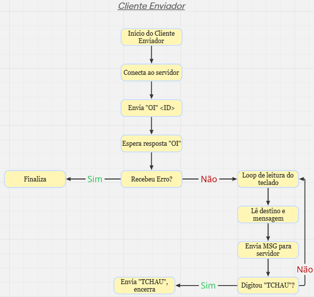

# Mini-X

`CAMPUS/UNIDADE: Puc Minas Campus Coração Eucaristico`

`CURSOÇ Engenharia de Computação 5º Semestre`

`SEMESTREÇ 1º Semestre - 2025`

`DISCIPLINA: Redes I`

## Integrantes

* Chrystian Henrique Fonseca de Souza
* Igor Gomes Silva Rattes
* Lucas Bretz Araujo Petinga

## Orientador

* Ricardo Carlini Sperandio

## Resumo

Este projeto tem como objetivo o desenvolvimento de um sistema de envio de mensagens curtas — uma espécie de mini-X (antigo Twitter) — operando em um ambiente multi-servidor.

Do ponto de vista funcional, o sistema permite a comunicação entre usuários por meio de mensagens curtas, simulando uma rede social distribuída.

Do ponto de vista didático, o foco está na aplicação de conceitos de programação orientada a eventos, com ênfase no uso da primitiva select e na temporização baseada em sinais, promovendo o domínio dessas técnicas em ambientes concorrentes.

# Arquitetura do Sistema

# Modo de Utilização

1. - Use o comando abaixo para compilar todos os programas (necessário make e gcc):
2. - Inicie o servidor  = ./servidor <PORTA>
3. - Inicie um ou mais clientes de exibição  = ./cliente_exibicao <ID_CLIENTE>
4. - Inicie um ou mais clientes de Envio  = ./cliente_envio <ID_CLIENTE> <IP_SERVIDOR> <PORTA>

# Apresentação

<ol>
<li><a href="Arq_Sistema"> Arquitetura do Sistema</a></li>
</ol>

# Documentação

<ol>
<li><a href="Documentacao/DocumentaçãoSistemasEmbarcados.pdf"> Documentação</a></li>
</ol>

